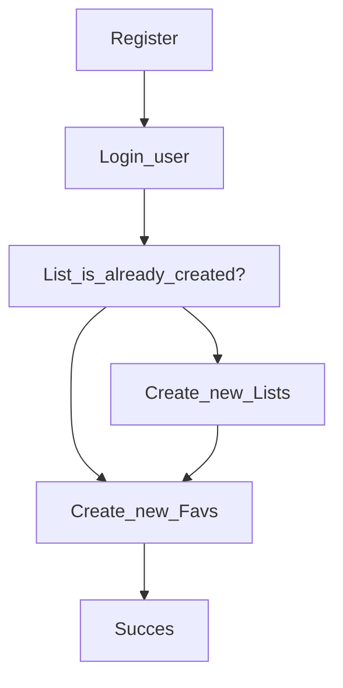
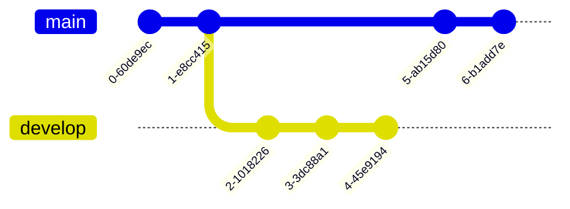

# Assesment Backend
    

### HOW TO RUN?

first step after download this repo, in your terminal:
`$ npm install`

if your prefer testing API using POSTMAN. Follow parameters depending what want consult.

### USER

**Description**

**Parameters**

Create new user:

	{
		"firstName": "your name",
		"lastName": "your lastname",
		"email": "your_email@email.com",
		"password": 1234567anypassword890
	}

Consult all user:

`endpoint: http://localhost:8080/api/users/`

Consult any user by your id:

`endpoint: http://localhost:8080/api/users/<user_id>`

**Routes**

| Route  | HTTP Verb  | Middleware | Description |
| ------------ | --------------- |  --------------- | --------------- |
| /api/users/      | GET | handleAllGetUsers( )  | Get all list of existing users |
| /api/users/:id      | GET |  | Get one existing user |
| /api/users     | POST | handleCreateUsers( )  | Create a new user | |

### FAVS
> Important: If want consult favs, required registered before and then consult this favs.

**Description**

**Parameters**

Consult all favs:

`endpoint: http://localhost:8080/api/favs/`

Consult any favs by your id:

`endpoint: http://localhost:8080/api/favs/<favs_id>`

Created new favs:

	{
		"createdBy": "<User_id>",
		"lists": "<Lists_id>",
		"title": "Title Favs",
		"description": "Any description",
		"link": "https://www.test.test/test"
	}

Deleted favs by id:

`endpoint: http://localhost:8080/api/favs/<favs_id>`

**Routes**

| Route  | HTTP Verb  | Middleware | Description |
| ------------ | --------------- | ------------ | ------------ |
| /api/favs/     | GET | isAuthenticated( ) handleGetAllFavs( )  | Get all list of existing favs |
| /api/favs/:id      | GET | isAuthenticated( ) handleGetFavs( ) | Get one existing favs |
| /api/favs     | POST | isAuthenticated( ) handleCreateFavs( )  | Create a new favs |
| /api/favs/:id     | DELETE | isAuthenticated( ) handleDeleteFavs( )  | Delete a favs by your id | |

### LSITS
> Important: If want consult favs, required registered before and then consult this favs.

**Description**

**Parameters**

Consult all lists:

`endpoint: http://localhost:8080/api/lists/`

Consult any lists by your id:

`endpoint: http://localhost:8080/api/lists/<favs_id>`

Created new lists:

	{
		"name": "Any name lists",
		"createdBy": "<User_id>"
	}

**Routes**

| Route  | HTTP Verb  | Middleware | Description |
| ------------ |--------------- | ------------ | ------------ |
| /api/lists/      | GET | isAuthenticated( ) handleAllGetLists( )  | Get all list of existing lists |
| /api/lists/:id      | GET | isAuthenticated( ) handleGetLists( ) | Get one existing lists |
| /api/lists     | POST | isAuthenticated( ) handleCreateLists( )  | Create a new lists | |

### FlowChart

### gitGraph

### Developer information

LinkedIn [Camilo Pimentel][id/name]

[id/name]: https://www.linkedin.com/in/camilo-pimentel-0a0232217/

